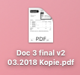
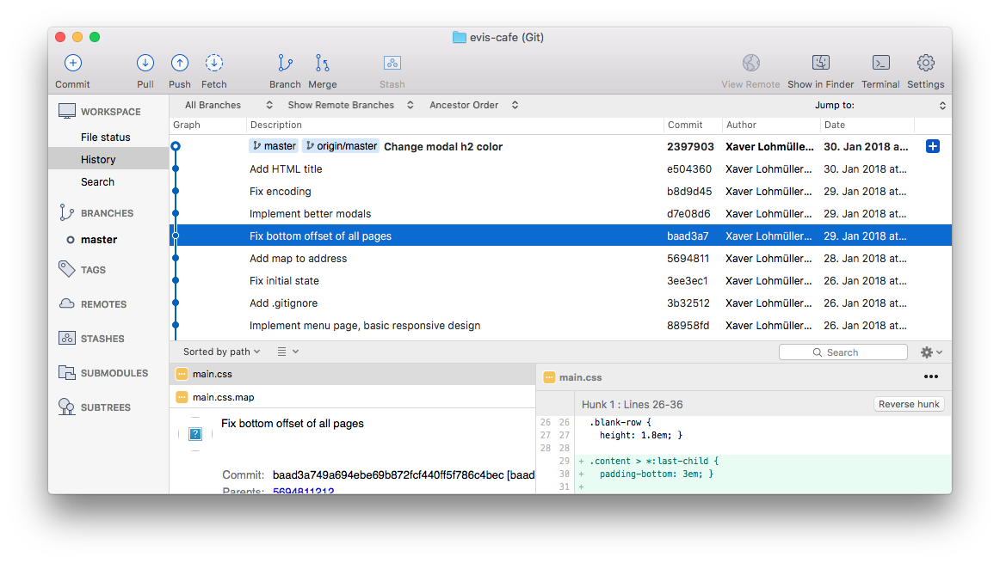
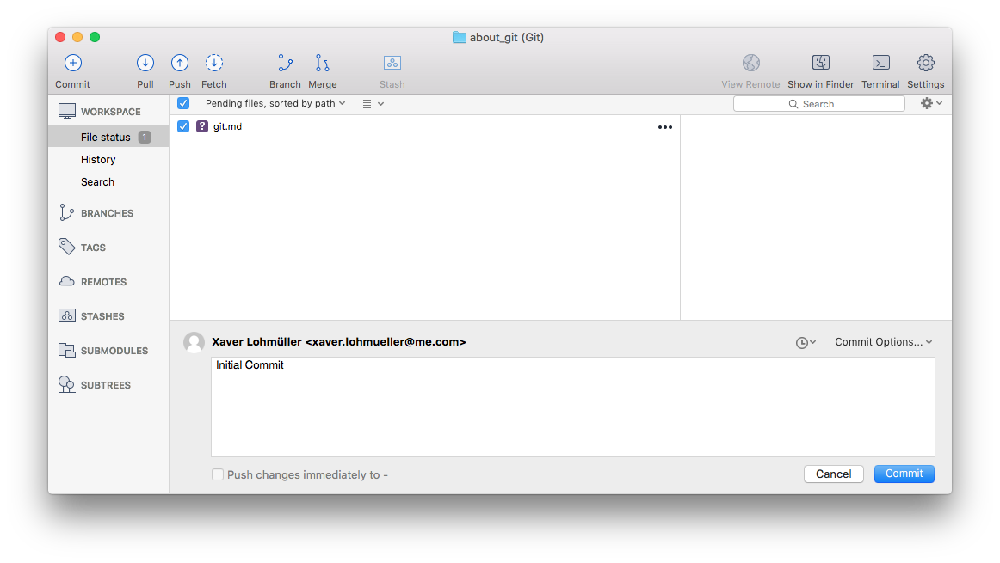
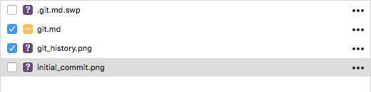
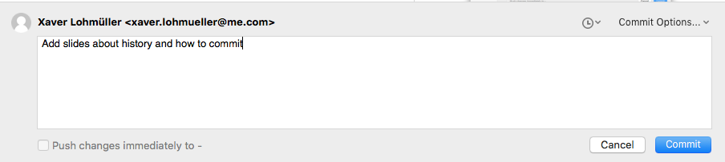
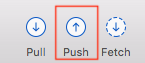
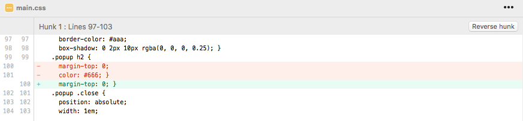
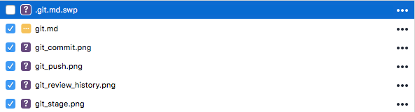
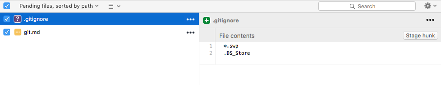

# About git

---

# History

---

# How To

---

1. Stage Files
2. Commit Files
3. Push Files

---

# 1. Stage Files

---

# 2. Commit Files

---

# 3. Push Files

---

# Make sure to review your changes

---

# `.gitignore`

---

# `.gitignore`

You can ignore unwanted files (or types) in `.gitignore`

---

# Thanks!
